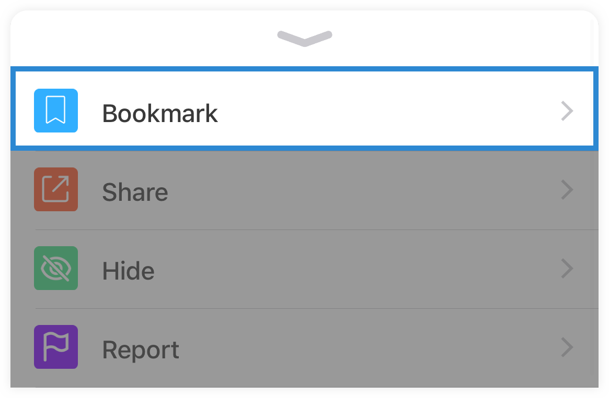
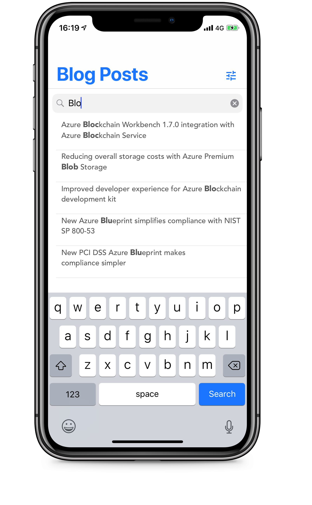

by [Mike James](https://twitter.com/mikecodesdotnet)

# Important News! 
App Center MBaaS will not mature out of preview. Read more about it [here](https://devblogs.microsoft.com/appcenter/app-center-mbaas-retirement/)

# The App

## About

Get notified when new Azure blog content is published to Microsoft blogs!

## Notifications

Receive push notifications in real-time as new blog posts are published. Tapping on a notification will open the post in your favorite browser or Azure News, depending on your settings.

Powered by Visual Studio App Center's Notification functionality, notifications are sent using the REST API, triggered from the codeless backend. It's also possible to segment users based on meta data collected through the analytics system for sending notifications to distinct groups of users.

## Authentication

Sign in using your Microsoft, Github, LinkedIn or create a username and password.

Powered by App Center's authentication functionality, which itself uses Active-Directory B2C, the app can authenticate with a variety of 3rd party identity providers.

Authentication occurs using a simple API provided by the App Center iOS SDK, which handles securely authenticating the user and managing the access token.

## Bookmarks

Bookmark your favorite blog posts for reading later.

Bookmarks are powered by Visual Studio App Centers User Data functionality, allowing for bookmarks across authenticated devices.

App Center provide an SDK which provides a simple API for interacting directly with Cosmos DB. User data is partitioned in such a way, which makes it only visible to the user who created the file.

## Search

Search for blog posts using the integrated search functionality found in the Blog Post tab. When searching, the app will show intelligent suggestions, ignoring spelling mistakes and understanding similes. You'll also see the UI will increase the contrast of hit, using hit-highlighting.

This functionality is powered by Azure Search, a managed Search as a Service, available from Microsoft. Azure Search provides a search engine for the app data which can be easily integrated. The app communicates directly with the service using its REST API, and the Swift implementation can be found in the Services directory. This was done in increase performance, though the service is currently hosting in only 1 location (UK South).

You can learn more about Azure Search by exploring the [official documentation](https://docs.microsoft.com/en-us/azure/search/) or get interactive with the [Introduction to Azure Search](https://docs.microsoft.com/en-us/learn/modules/intro-to-azure-search/) Microsoft Learn module.

## Bring your own Browser (BYOB)

Don't just use Safari if you love Edge or another awesome browser! Azure News supports a variety of 3rd party browsers for viewing blog post content. By default you'll use the Embedded Safari option, which provides the ability to enable Reader mode. You can change your browser at any moment using the in-app settings, found in General > Browser. The app will display a list of installed browsers which are supported.

 If your favorite browser isn't supported then don't fret! Create a Github issue to let me know and I'll get it added asap, or take a look at the simple implementation and create a pull request.

---

## App Icons

Choose from 16 illustrated App Icons created by the amazing [Ashley McNamara](https://github.com/ashleymcnamara)!

# Powered by Azure & Visual Studio App Center

The applications backend is entirely powered by Azure services, providing infrastructure that can scale to meet unlimited demand.

The backend services have been developed using Azure Logic Apps, which provide a codeless programming environment to glue together disparate services. Below you can see the logic flow for how new content is added to the app.

