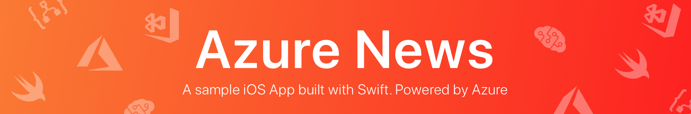
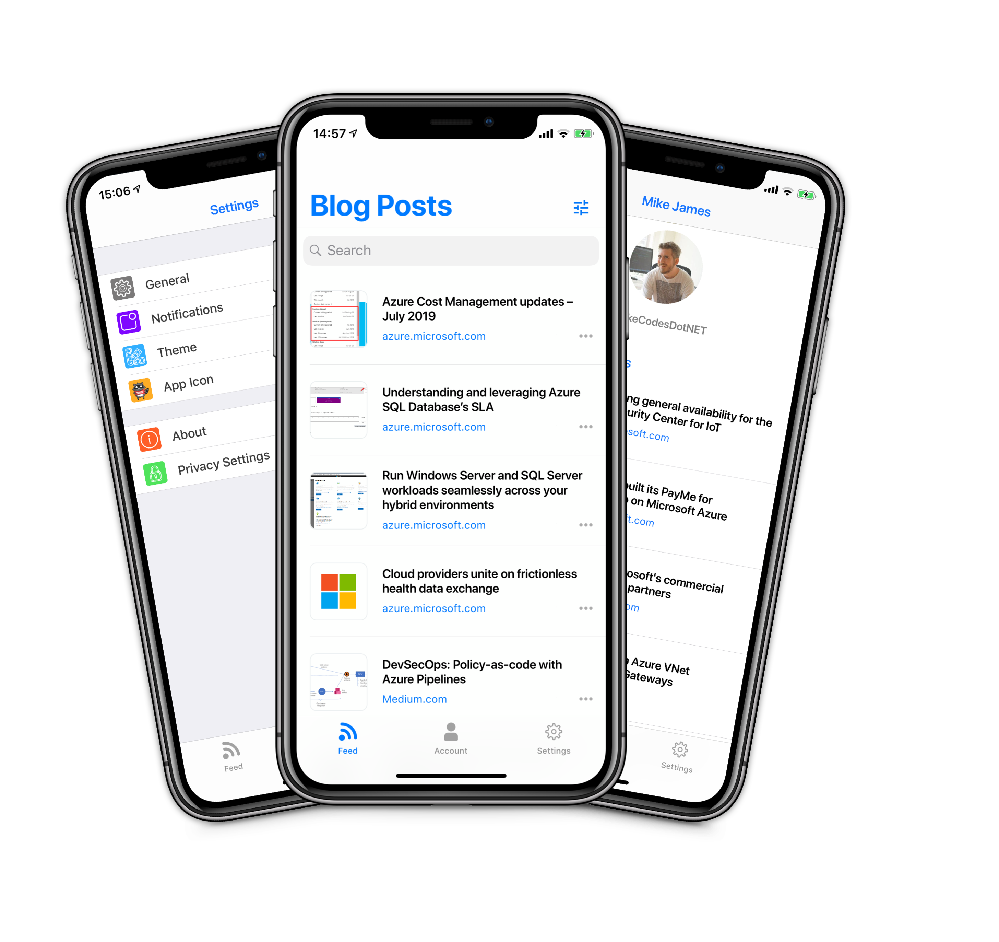
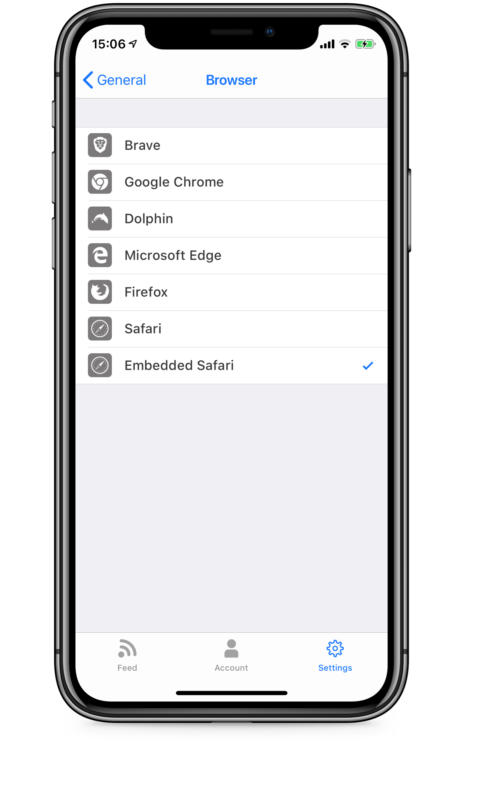
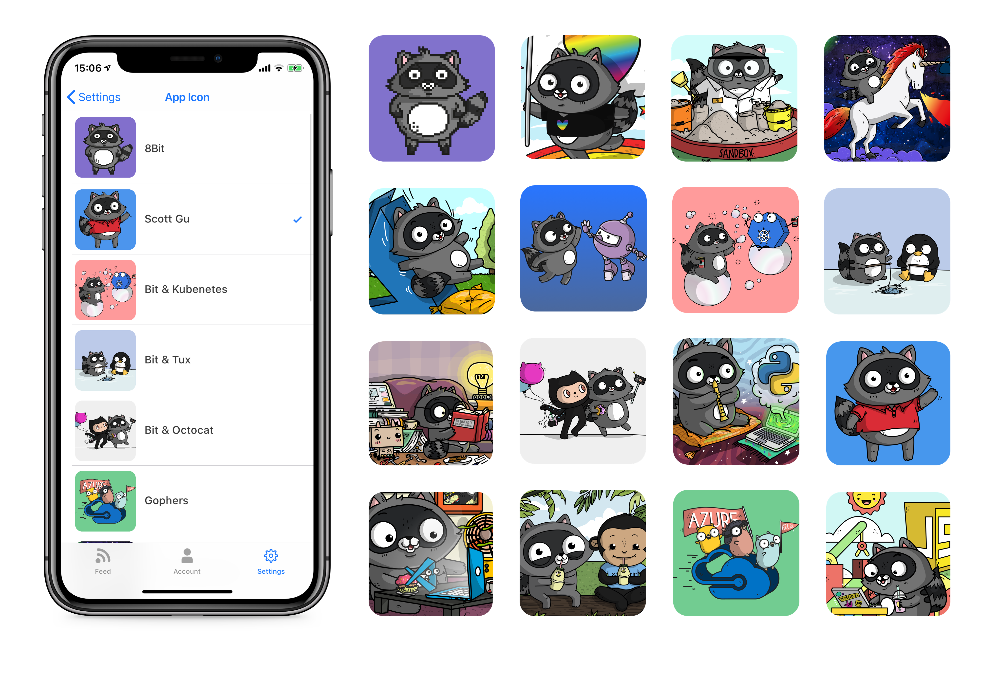
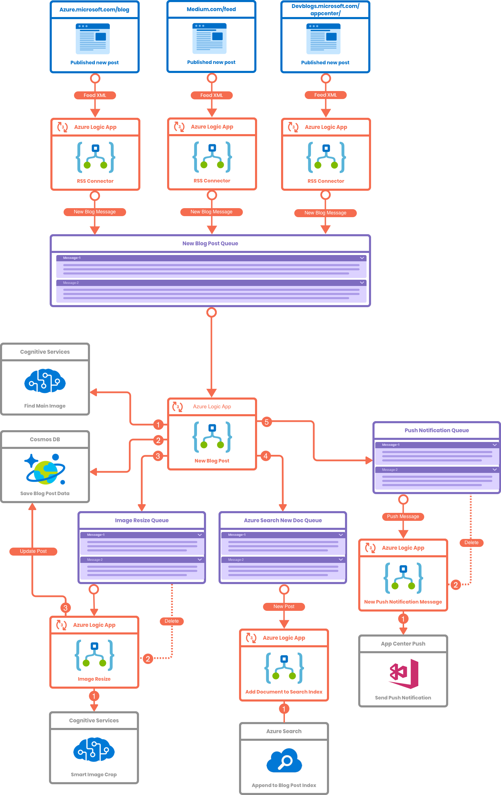

by [Mike James](https://twitter.com/mikecodesdotnet)

# The App 

## About

Get notified when new Azure blog content is published to Microsoft blogs! 

## Notifications 

Recieve push notifications in realtime as new blog posts are published. Tapping on a notification will open the post in your favourite browser or Azure News, depending on your settings. 

Powered by Visual Studio App Center's Notification functionality, notifications are sent using the REST API, triggered from the codeless backend. It's also possible to segment users based on meta data collected through the analytics system for sending notifications to distinct groups of users. 

## Authenitication 
Sign in using your Microsoft, Github, LinkedIn or create a username and password. 

Powered by App Center's authentication functionality, which itself uses Active-Directory B2C, the app can authenticate with a variety of 3rd party indentity providers. 

Authentication occurs using a simple API provided by the App Center iOS SDK, which handles securely authenticating the user and managing the access token. 

## Bookmarks 

Bookmark your favourite blog posts for later. 
Bookmarks are powered by Visual Studio App Centers User Data functionality, allowing for storing and sync bookmarks accross authenticated devices. 

## Bring your own Broswer (BYOB)

Don't just use Safari is you love Edge or another awesome browser! Azure News supports a variety of 3rd party browsers for viewing blog post content. By default you'll use the Embedded Safari option, which provides the ability to enable Reader mode. You can change your browser at any moment using the in-app settings, found in General > Browser. The app will display a list of installed browsers which are supported. 

### Supported Browsers:
* Brave
* Chrome 
* Dolphin 
* Edge
* Firefox
* Safari 

 If your favourite browser isn't supported then don't fret! Create a Github issue to let me know and I'll get it added asap, or take a look at the simple implementation and create a pull request.

---

## App Icons 
Choose from 16 illustrated App Icons created by the amazing [Ashley McNamara](https://github.com/ashleymcnamara)!

# Powered by Azure & Visual Studio App Center

The applications backend is entirely powered by Azure services, providing infrastrcture that can scale to meet unlimited demand.

The backend services have been developed using Azure Logic Apps, which provide a codeless programming environment to glue together desprate services. Below you can see the logic flow for how new content is added to the app. 

